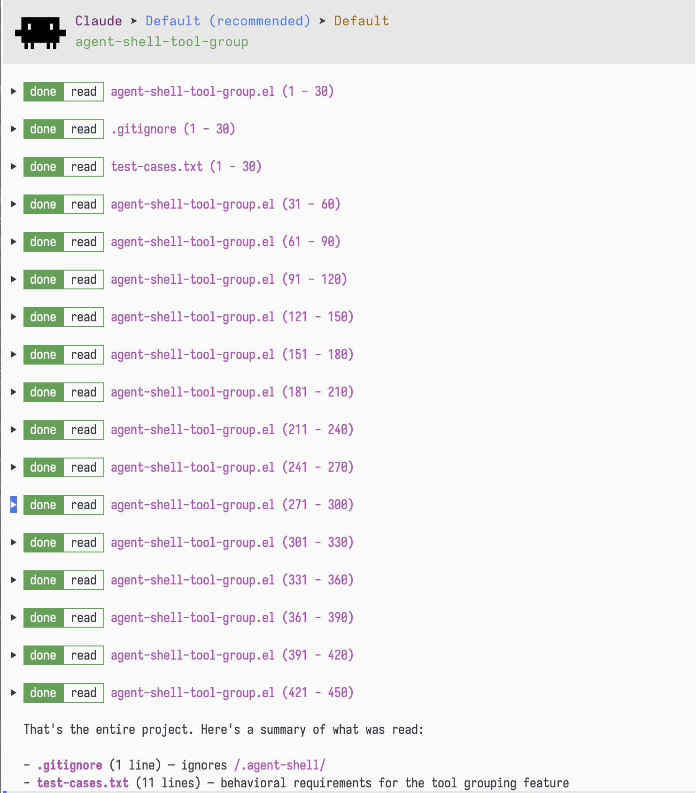
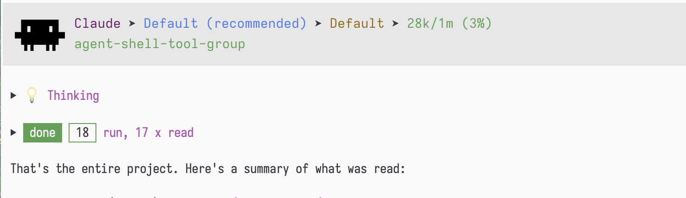

# agent-shell-tool-group

Group consecutive tool calls in [agent-shell](https://github.com/xenodium/agent-shell) buffers under a single collapsible header.

**Before:**



**After:**



## Requirements

- Emacs 29.1+
- [agent-shell](https://github.com/xenodium/agent-shell) 0.1+

## Installation

### Manual

Clone the repository and add it to your load path:

```elisp
(add-to-list 'load-path "/path/to/agent-shell-tool-group")
(require 'agent-shell-tool-group)
(agent-shell-tool-group-mode 1)
```

## Usage

Enable the global minor mode:

```elisp
(agent-shell-tool-group-mode 1)
```

Once enabled, consecutive completed tool calls (2 or more by default) are automatically grouped when a turn completes.

### Navigation

- `n` / `p` — navigate between groups (collapsed groups are skipped over)
- `RET` / `TAB` / mouse click — toggle a group open/closed
- When expanded, individual tool calls inside the group can be navigated and toggled independently

### Commands

| Command | Description |
|---|---|
| `agent-shell-tool-group-mode` | Toggle the global minor mode |
| `agent-shell-tool-group-ungroup-all` | Remove all groups in the current buffer |
| `agent-shell-tool-group-ungroup-at-point` | Remove the group at point |

## Customization

| Variable | Default | Description |
|---|---|---|
| `agent-shell-tool-group-min-count` | `2` | Minimum consecutive tool calls to form a group |
| `agent-shell-tool-group-label-format` | `"Tool Calls (%s)"` | Format string for the group header (`%s` is replaced with a summary like "3 x find, read") |

## License

GPL-3.0-or-later
